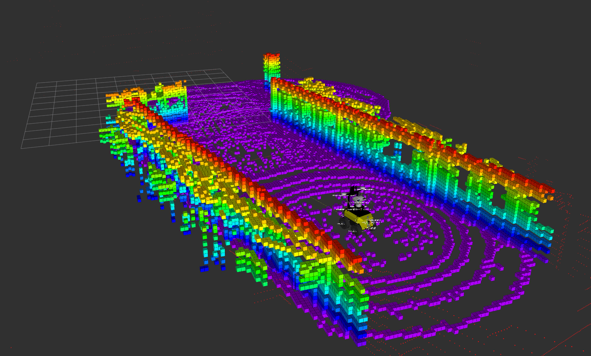

# Husky Simulation Repository

# SETUP SIMULATOR and RVIZ

1. Setup docker on your computer
2. Clone the repo to root
3. Go to repo, in my case `cd /home/emil/husky_sim`
4. Follow steps below

```
# Build docker image
./run_jazzy.sh build

# Start docker environment
./run_jazzy.sh run

# Simulator
ros2 launch clearpath_gz simulation.launch.py

For more info: https://docs.clearpathrobotics.com/docs/ros/tutorials/simulator/overview

# In simulator window
change cmd_vel to /a201_0000/cmd_vel

# Now you should be able to control Husky
# use keys to control husky

# Start a new terminal (Ctrl + Shift + T)
./run_jazzy.sh bash

# Rviz
ros2 launch clearpath_viz view_robot.launch.py namespace:=a201_0000

# Also, here you can add the pointcloud as a topic to visualize
```

# For more info on how to configure robot.yaml
* https://docs.clearpathrobotics.com/docs/ros/config/yaml/overview/
* https://github.com/clearpathrobotics/clearpath_config/tree/jazzy/clearpath_config/sample


# DAEP - INSTALL AND TEST
To setup DAEP we need some additional packages. First, standing in `husky_ws`, create a ros2 workspace called `husky_ws`.

```
mkdir -p husky_ws/src
```

In this src-folder, we are going to install all packages (modules of code) that we need. The structure of the repo should be as below after you are done. Note that you will add in your code as packages later.

## Repository Structure

```
husky_sim/
├── husky_ws/src/                      # ROS 2 workspace source packages
│   ├── daep/                          # 🎯 Main DAEP exploration package (Emil)
│   ├── daep_msgs/                     # 📦 Custom message definitions
│   ├── lrs_exec/                      # 📦 LRS execution package
│   ├── lrs_msgs_common/               # 📦 LRS common messages
│   ├── lrs_msgs_tst/                  # 📦 LRS test messages
│   ├── lrs_srvs_exec/                 # 📦 LRS execution services
│   ├── lrs_srvs_ra/                   # 📦 LRS RA services
│   ├── lrs_srvs_tst/                  # 📦 LRS test services
│   ├── lrs_srvs_wdb/                  # 📦 LRS WDB services
│   ├── lrs_turtle4/                   # 📦 LRS Turtlebot4/Husky integration
│   ├── lrs_util/                      # 📦 LRS utilities
|   ├── **WAQAS PACKAGE**              # Waqas code
|   └── **VAHAB PACKAGE**              # Vahab code
├── clearpath/                         # Clearpath Robotics configuration
│   └── robot.yaml                     # Main robot configuration
├── Dockerfile                         # Docker configuration
├── run_jazzy.sh                       # Docker run script
└── README.md                          # This file
```

**Please install these in src (so you get the structure above):**
```
git clone https://gitlab.liu.se/real-lab/daep.git
git clone https://gitlab.liu.se/real-lab/daep_msgs.git
git clone https://gitlab.liu.se/lrs2/lrs_turtle4.git
git clone https://gitlab.liu.se/lrs2/lrs_util.git
git clone https://gitlab.liu.se/lrs2/lrs_exec.git
git clone https://gitlab.liu.se/lrs2/lrs_msgs_common.git
git clone https://gitlab.liu.se/lrs2/lrs_msgs_tst.git
git clone https://gitlab.liu.se/lrs2/lrs_srvs_exec.git
git clone https://gitlab.liu.se/lrs2/lrs_srvs_ra.git
git clone https://gitlab.liu.se/lrs2/lrs_srvs_tst.git
git clone https://gitlab.liu.se/lrs2/lrs_srvs_wdb.git
```

**Then you shoule be able to build all packages**

```
./run_jazzy run (or bash)

# Make sure you are standing in husky_ws, then run

colcon build --symlink-install
```
**After this you should be able to launch RVIZ**
```
# Rviz for DAEP (Weird workaround to make octomap_rviz_plugin work)

./run_jazzy.sh bash

# Clearpath Version
LD_PRELOAD=/usr/lib/x86_64-linux-gnu/liboctomap.so ros2 launch clearpath_viz view_robot.launch.py namespace:=a201_0000

# DAEP Version (Using our own .rviz file, also included in tmux by default)
LD_PRELOAD=/usr/lib/x86_64-linux-gnu/liboctomap.so ros2 launch daep view_robot.launch.py namespace:=a201_0000

# Add these topics (will get a .rviz file soon)
/husky0/octomap_full
/husky0/filtered_octomap
/a201_0000/sensors/lidar3d_0/points (heavy to run for gpu)
/husky0/daep_marker_array_visualization (Local planner)
/husky0/rrt_star_marker_array (global planner)
/husky0/bounds_visualization (bounds, path and frustum)
/husky0/rrt_path (chosen global frontier)
/husky0/frontier_marker_array (frontiers)
/husky0/sampled_node (collision checking)
/husky0/daep_marker_visualization (simulated, simple dynamic obstacle)
```

**and TMUX**

```
./run_jazzy.sh bash

# Staic
~/husky_ws/src/daep/tmux/daep.tmux --sim --husky --ns /husky0 --config warehouse_exploration.yaml

# Dynamic
~/husky_ws/src/daep/tmux/daep.tmux --sim --husky --ns /husky0 --config warehouse_exploration.yaml --dynamic-objects
```
